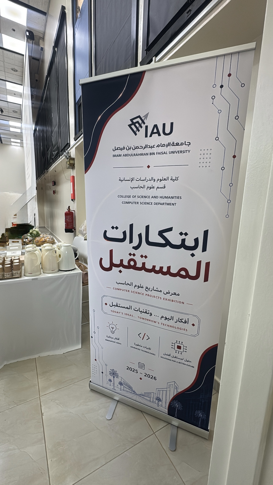
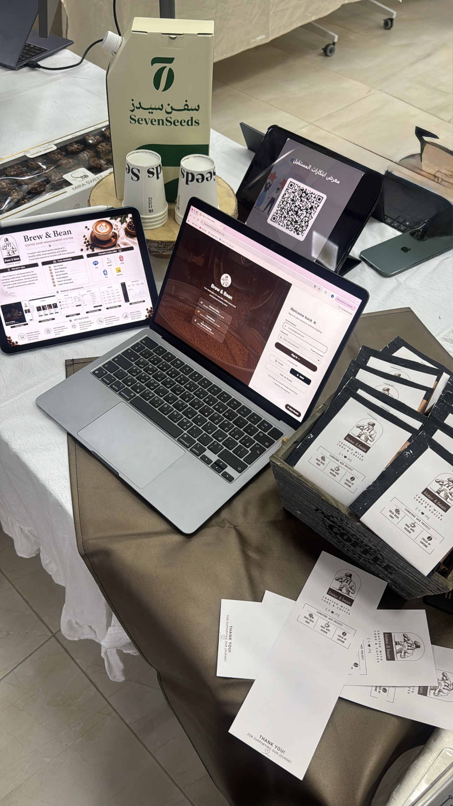
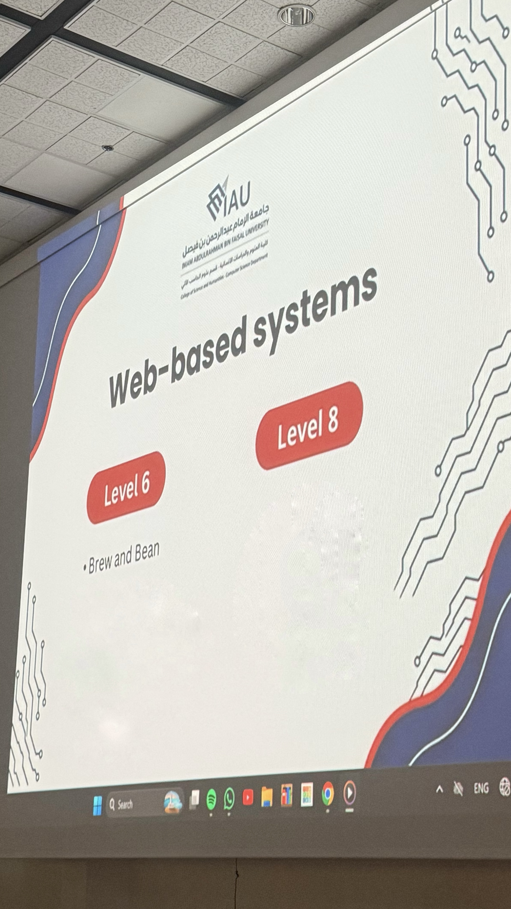
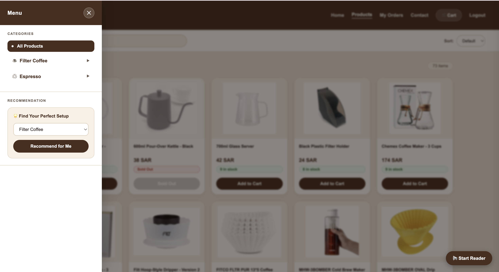

# Brew & Bean ☕

> Selected for the "Future Innovations" Computer Science Exhibition.

A web-based coffee shop management system developed as a university project.

---

## Overview

Brew & Bean is a university web project designed to simulate a modern coffee shop management experience through an interactive and user-friendly website.

The system focuses on creating a smooth ordering experience while providing an organized and visually appealing interface for users.

---

## Features

- Coffee menu display
- User-friendly interface
- Responsive web design
- Smooth navigation system
- Order management functionality
- Modern UI design

---

## Technologies Used

- HTML
- CSS
- JavaScript
- PHP
- Xampp

---

## Achievement

This project was selected to participate in the **"Future Innovations" Computer Science Projects Exhibition** at our college.

The exhibition showcased outstanding student projects and innovative technical ideas developed by Computer Science students.

---

## Exhibition Photos

### Future Innovations Exhibition

### Brew & Bean Booth

### Selected Project

---

## Project Screenshots

### Login System

### Home Page

### Menu Page

### Order Confirmation

### Orders Tracking

---

## 📌 Project Status

Completed as part of a university coursework project.

